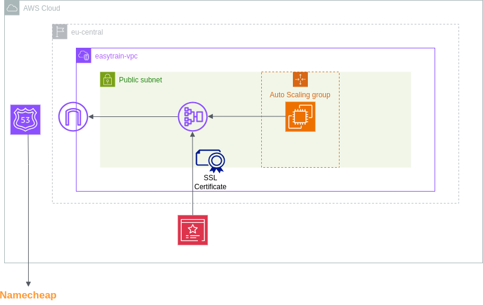
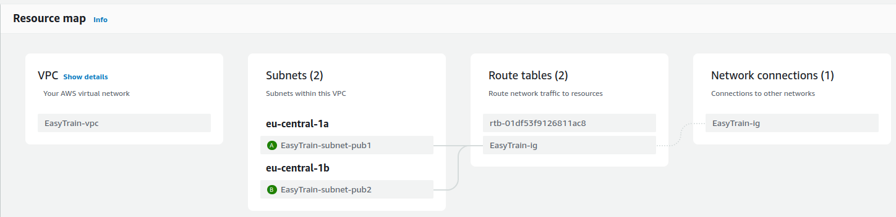
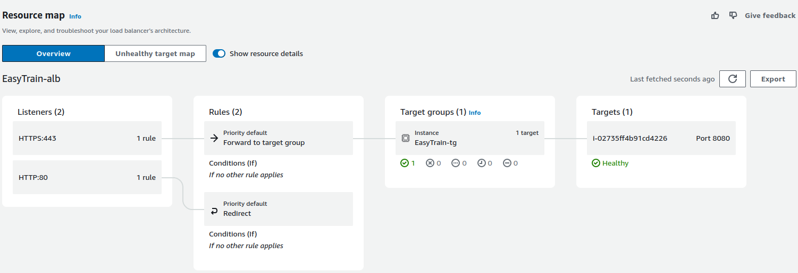

# EasyTrain-Terraform

Terraform templates that provision AWS infrastructure for [easytrain/applicaion](https://github.com/EasyTrain/application) project.

This project is deployed on AWS at [Easytrain.live](https://easytrain.live/)

## AWS Architecture



## Description

The Terraform main.tf file provisions the following AWS resources:
- VPC in the eu-central-1 region
- Public subnet in the eu-central-1a availability zone
- Routing table and internet gateway
- An EC2 instance and a security group
  - Security Group ingress/egress rules:
    - SSH
    - HTTP (required by loadl balancer) 
    - Port 587 (required to send emails out)
- Load Balancer
- Route53 hosted zone
  - A record that points to the public IP

  ### easytrain.live
  - The domain name was purchased through Namecheap.com
  - A CA certificate is attached to the load balancer which
  enables end-to-end encryption of all data sent between clients
  and the server.

## Dependencies

This project requires the following:
- Terraform version >=1.8.5  
- AWS provider version ~>5.54.1
- AWS CLI 1.15.58
- A valid AWS Access Key

## VPC Resource Map



## Load Balancer Resource Map



## Terraform Files
```
├── images
│   ├── easytrain.drawio.png
│   └── easytrain-terraform.png
├── LICENSE
├── main.tf
├── outputs.tf
├── README.md
├── user_data.sh
├── variables.tf
└── versions.tf
```

## License

This project is licensed under the MIT License - see the LICENSE file for details.